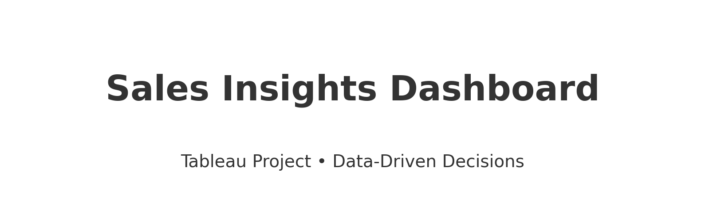

# Sales Insights Dashboard (Tableau)



[](#)
[](LICENSE)


A clean, step-by-step **Tableau Sales Insights** project that demonstrates how to go
from raw transactions to an interactive dashboard and actionable insights.

## 🎯 Overview
- **Goal:** Unlock hidden sales insights for decision support and reduce manual effort.
- **What you get:** Documentation, ETL steps, a walkthrough, and PDF visuals.
- **Stack:** MySQL (OLTP) ➜ ETL ➜ Tableau (OLAP-style analytics).

## 🧭 Quick Start
1) Clone or download this repo.
2) Open `docs/Sales-Insights-Project.pdf` for the full dashboard snapshots.
3) Read `docs/Walkthrough.md` and `docs/ETL.md` for the exact steps.
4) (Optional) Export key dashboard sheets as PNGs and add them to `assets/`.
5) Add your `.twbx` (Tableau) file to `/tableau` (create the folder) if you want to version it.

## 🧩 Problem Summary
Large, multi-region hardware sales; leadership needs trustworthy insights on **top customers/products,
weak regions, revenue trends**, and **year-to-date** performance. Manual Excel-based updates are slow and
inconsistent. A single, interactive Tableau view solves this by centralizing metrics and filtering by region/city.

## 🏗️ Data Architecture
- **MySQL:** captures day-to-day transactions efficiently.
- **ETL:** extract ➜ transform (clean/filter/calc fields) ➜ load for analysis.
- **Analytics in Tableau:** star-style model with a **Transactions** fact table and dimension tables;
designed for slicing by markets, customers, products, and time.

See `docs/Walkthrough.md` for the AIMS Grid and full details.

## 📊 Dashboard Highlights
- Revenue and quantity trends by month and year
- Top customers and top products by revenue
- City/market performance comparisons
- High-level KPIs for revenue and sales quantity

Full visuals: `docs/Sales-Insights-Project.pdf`.

## 📁 Repository Structure
```
sales-insights-tableau-repo/
├─ assets/
│  ├─ Revenue by Year.png
│  ├─ Sales Quantity by Markets.png
│  ├─ Revenue by Markets.png
│  └─ intro image.png
├─ docs/
│  ├─ Sales-Insights-Project.pdf
│  ├─ Sales-Insights-Project-Steps.docx
│  ├─ Walkthrough.md
│  └─ ETL.md
├─ .gitignore
├─ LICENSE
├─ README.md
└─ sql-analysis
   └─sql-queries.md

```


## 📝 License
MIT — see [LICENSE](LICENSE).

---

> Tip: You can also host an interactive version on **Tableau Public** and link it here.
